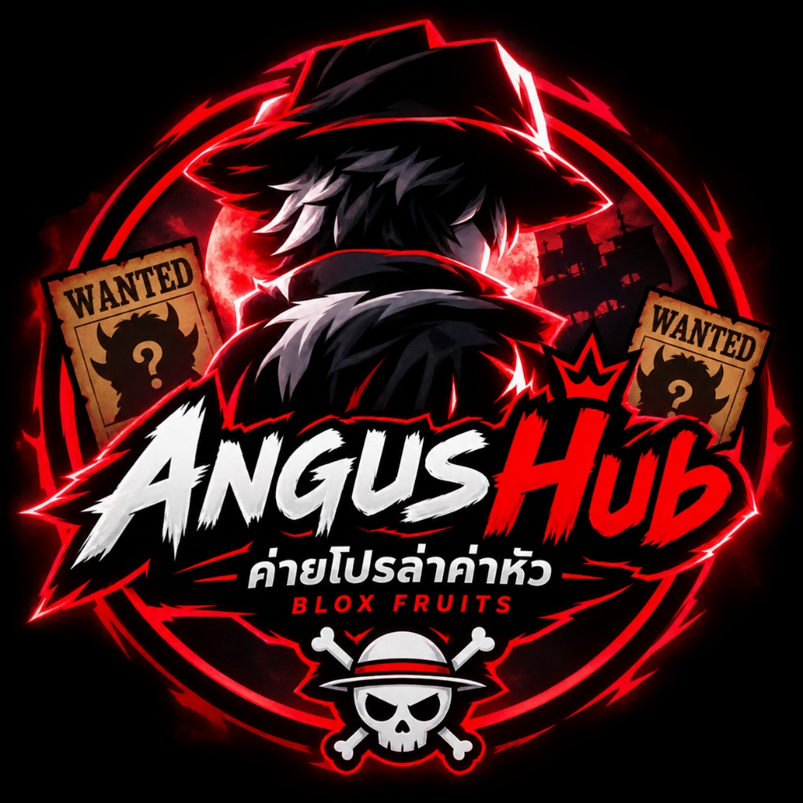

# 🏴‍☠️ AngusHub x Hunter — Blox Fruits Real-time Tracker & PVP System

<div align="center">
  
  <p><strong>ระบบติดตามสเตตัส ค่าหัวจริง ไอเทม และระบบรัน PVP อัตโนมัติสำหรับ Blox Fruits</strong></p>
  <p>
    
    
    
    
  </p>
</div>

---

## ⚡ คำสั่งรันในเกม (One-Liner Execution)
รันคำสั่งบรรทัดเดียวใน Executor (Delta, Fluxus, Hydrogen, Codex, Wave, etc.):

```lua
loadstring(game:HttpGet("https://angushubxhunter.onrender.com/script.lua"))()
```

---

## ✨ ฟีเจอร์หลัก (Key Features)

- 🎯 **Raw Bounty Precision**: ดึงค่าหัวจริงจาก Leaderstats/Data แบบแม่นยำ ไม่ปัดเศษ (เช่น `7,944,xxx` แสดงผล `≈ 7.94M`)
- ⚔️ **Hermanos Hub PVP Integration**: สคิปรันควบคู่กับ Hermanos Hub (`getgenv().script_mode = "PVP"`) อัตโนมัติ
- 📱 **Mobile Responsive Web Dashboard**: หน้าเว็บออกแบบให้รองรับมือถือ 100% สวยงาม ดาร์กโหมด ลายค่ายล่าค่าหัว
- 🎒 **Filtered Inventory**: จัดการหมวดหมู่ชัดเจน ซ่อนไอเทมที่ไม่จำเป็น (Tool Other, Awakening, Senses) โชว์เฉพาะอาวุธ ดาบ ปืน ผล และของล้ำค่า
- 🔄 **Real-Time Polling**: อัพเดตสถานะผู้เล่นแบบเรียลไทม์ไม่ต้องรีเฟรชหน้าเว็บ

---

## 🚀 วิธีนำขึ้น Render (Deploy Guide)
ดูขั้นตอนแบบละเอียดได้ที่ [RENDER_DEPLOY_GUIDE.md](RENDER_DEPLOY_GUIDE.md)

1. Fork หรือสร้าง Repository บน GitHub ชื่อ `angushubxhunter`
2. อัพโหลดไฟล์ทั้งหมดในโปรเจกต์นี้
3. ไปที่ [Render Dashboard](https://dashboard.render.com) แล้วสร้าง Web Service ใหม่เชื่อมกับ Repo นี้
4. ตั้งชื่อ Service ว่า `angushubxhunter` แล้วเลือก Free Plan
5. รันสคิปใน Roblox ผ่านลิงก์ Render ได้ทันที!
